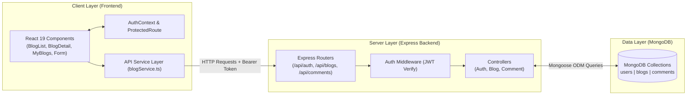

# 🕷️ FullStack Blogs (Spiderum Platform)

Hệ thống nền tảng Blog Full-Stack hiện đại, chuẩn kiến trúc Type-Safe từ Frontend đến Backend, tích hợp cơ chế xác thực JWT, phân quyền đa cấp, quản lý bài viết cá nhân, hệ thống bình luận và bộ kiểm thử tự động toàn diện.

---

## 📑 Mục lục

- [1. Giới thiệu](#1-giới-thiệu)
- [2. Công nghệ sử dụng (Tech Stack)](#2-công-nghệ-sử-dụng-tech-stack)
- [3. Tính năng chính (Features)](#3-tính-năng-chính-features)
- [4. Cấu trúc Dự án (Project Structure)](#4-cấu-trúc-dự-án-project-structure)
- [5. Kiến trúc Hệ thống (System Architecture)](#5-kiến-trúc-hệ-thống-system-architecture)
- [6. Xác thực & Phân quyền (Auth & Security)](#6-xác-thực--phân-quyền-auth--security)
- [7. Danh sách RESTful APIs](#7-danh-sách-restful-apis)
- [8. Hướng dẫn Cài đặt & Chạy ứng dụng](#8-hướng-dẫn-cài-đặt--chạy-ứng-dụng)
- [9. Biến Môi trường (Environment Variables)](#9-biến-môi-trường-environment-variables)
- [10. Kiểm thử Tự động (Testing)](#10-kiểm-thử-tự-động-testing)
- [11. Tự động hóa CI (GitHub Actions)](#11-tự-động-hóa-ci-github-actions)
- [12. Tài liệu Dự án (Documentation)](#12-tài-liệu-dự-án-documentation)
- [13. Lộ trình Phát triển (Roadmap)](#13-lộ-trình-phát-triển-roadmap)

---

## 1. Giới thiệu

**FullStack Blogs** là ứng dụng chia sẻ kiến thức và thảo luận bài viết lấy cảm hứng từ nền tảng Spiderum. Dự án được xây dựng với mục tiêu chuẩn hóa mã nguồn thực tế cho Portfolio, thể hiện đầy đủ năng lực ở các mảng: **Frontend Architecture, Backend API Design, Database Modeling, Security & Authorization, Automation Testing** và **Business Analysis**.

**Các luồng hoạt động chính:**
- Đăng ký, đăng nhập và duy trì phiên đăng nhập an toàn qua JWT Token.
- Đọc bài viết, tự động tăng lượt xem (Views), thích bài viết (Likes), lọc theo danh mục và tìm kiếm từ khóa.
- Viết bài mới, cập nhật và xóa bài viết với phân quyền nghiêm ngặt giữa tác giả và quản trị viên.
- Trang "Bài viết của tôi" (My Blogs) hiển thị số liệu thống kê (Tổng bài, Tổng views, Tổng likes) và công cụ quản trị bài viết.
- Gửi bình luận và xóa bình luận (cho phép người viết comment hoặc quản trị viên thực hiện).

---

## 2. Công nghệ sử dụng (Tech Stack)

### Frontend
- **Core**: React 19, TypeScript
- **Build Tool**: Vite 7
- **Routing**: React Router v7
- **Styling**: Vanilla CSS (Modern Slate & Emerald Design System, Responsive)
- **State Management**: React Context API (`AuthContext`)

### Backend
- **Platform**: Node.js
- **Framework**: Express 5 (TypeScript)
- **Database ODM**: Mongoose 9
- **Authentication & Security**: JSON Web Token (`jsonwebtoken`), `bcryptjs`, `cors`
- **Configuration**: `dotenv`

### Cơ sở dữ liệu
- **Database**: MongoDB (Local / Cloud Atlas compatible)
- **Collections**: `users`, `blogs`, `comments`

### Kiểm thử (Testing)
- **Test Runner & Assertion**: Vitest
- **Code Coverage**: `@vitest/coverage-v8`

---

## 3. Tính năng chính (Features)

| Phân hệ / Chức năng | Mô tả chi tiết | Trạng thái |
| :--- | :--- | :---: |
| **Đăng ký tài khoản (Register)** | Xác thực dữ liệu hợp lệ (Username $\ge$ 3 ký tự, Email regex, Mật khẩu $\ge$ 6 ký tự), mã hóa mật khẩu bcrypt, kiểm tra trùng lặp email/username. | ✅ Hoàn thành |
| **Đăng nhập (Login)** | Đăng nhập linh hoạt bằng Email hoặc Username, cấp phát JWT Token (hạn 7 ngày). | ✅ Hoàn thành |
| **AuthContext & Token Sync** | Quản lý trạng thái xác thực toàn cục, tự động gọi `GET /api/auth/me` kiểm tra token khi khởi động hoặc F5. | ✅ Hoàn thành |
| **ProtectedRoute (Zero-Flicker)** | Bảo vệ các route `/create`, `/blog/:id/edit`, `/my-blogs`, xử lý loading chống nhấp nháy UI và tự động chuyển hướng về `/login`. | ✅ Hoàn thành |
| **Trang chủ & Danh sách Blog** | Phân trang linh hoạt (`page`, `limit`), lọc theo danh mục (Sidebar), tìm kiếm bài viết theo từ khóa tiêu đề (`/search`). | ✅ Hoàn thành |
| **Chi tiết bài viết (Blog Detail)** | Xem nội dung bài viết, tự động cộng dồn lượt xem (`/view`), thả tim (`/like`), nút Sửa/Xóa hiển thị theo quyền tác giả/admin. | ✅ Hoàn thành |
| **Đăng bài & Sửa bài** | Form chọn danh mục, nhập tiêu đề, nội dung với thông báo lỗi và trạng thái loading trực quan. | ✅ Hoàn thành |
| **Bài viết của tôi (My Blogs)** | Bảng quản lý bài viết của riêng user kèm 3 thẻ thống kê tổng quan (Tổng bài viết, Tổng lượt xem, Tổng lượt thích). | ✅ Hoàn thành |
| **Hệ thống Bình luận** | Gửi bình luận khi đã đăng nhập; Khách vãng lai thấy banner nhắc đăng nhập. | ✅ Hoàn thành |
| **Xóa Bình luận** | Xóa bình luận có modal xác nhận; chỉ chủ comment hoặc admin mới có quyền xóa. | ✅ Hoàn thành |
| **Xóa bài viết & Cascade Delete** | Hỗ trợ xóa mềm và xóa cứng; tự động xóa sạch các bình luận liên quan khi bài viết bị xóa khỏi database. | ✅ Hoàn thành |
| **Trang lỗi 404** | Giao diện NotFound thân thiện và nút quay về trang chủ. | ✅ Hoàn thành |

---

## 4. Cấu trúc Dự án (Project Structure)

```text
FullStack_Blogs/
├── backend/
│   ├── src/
│   │   ├── config/              # Cấu hình kết nối MongoDB
│   │   │   └── db.ts
│   │   ├── controllers/         # Xử lý logic nghiệp vụ các endpoints
│   │   │   ├── auth.controller.ts
│   │   │   ├── auth.controller.test.ts
│   │   │   ├── blog.controller.ts
│   │   │   ├── blog.controller.test.ts
│   │   │   ├── comment.controller.ts
│   │   │   └── comment.controller.test.ts
│   │   ├── interfaces/          # Định nghĩa TypeScript interfaces (Auth, Blog)
│   │   │   ├── auth.interface.ts
│   │   │   └── blog.interface.ts
│   │   ├── middlewares/         # Middleware xác thực JWT và log request
│   │   │   ├── auth.middleware.ts
│   │   │   ├── auth.middleware.test.ts
│   │   │   └── logger.middleware.ts
│   │   ├── models/              # Schema Mongoose (User, Blog, Comment)
│   │   │   ├── user.model.ts
│   │   │   ├── blog.model.ts
│   │   │   └── comment.model.ts
│   │   ├── routes/              # Định tuyến Express Router
│   │   │   ├── auth.route.ts
│   │   │   ├── blog.route.ts
│   │   │   └── comment.routes.ts
│   │   ├── app.ts               # Khởi tạo Express App & Middlewares
│   │   └── index.ts             # Entry point máy chủ Backend
│   ├── package.json
│   ├── tsconfig.json
│   └── vitest.config.ts
│
├── frontend/
│   ├── src/
│   │   ├── components/          # Reusable UI Components
│   │   │   ├── Navbar.tsx
│   │   │   ├── Footer.tsx
│   │   │   ├── BlogCard.tsx
│   │   │   ├── Sidebar.tsx
│   │   │   └── ProtectedRoute.tsx
│   │   ├── context/             # React Context quản lý Auth toàn cục
│   │   │   └── AuthContext.tsx
│   │   ├── pages/               # Các trang giao diện ứng dụng
│   │   │   ├── BlogList.tsx
│   │   │   ├── BlogDetail.tsx
│   │   │   ├── CreateBlog.tsx
│   │   │   ├── EditBlog.tsx
│   │   │   ├── MyBlogs.tsx
│   │   │   ├── Login.tsx
│   │   │   ├── Register.tsx
│   │   │   └── NotFound.tsx
│   │   ├── services/            # Tầng gọi API Fetch tập trung
│   │   │   └── blogService.ts
│   │   ├── App.tsx              # Cấu hình Routing chính
│   │   ├── main.tsx             # Entry point React
│   │   └── index.css            # Stylesheet toàn dự án
│   ├── package.json
│   ├── tsconfig.json
│   └── vite.config.ts
│
├── docs/                        # Tài liệu phân tích nghiệp vụ & kiểm thử
│   ├── ba_specification.md      # Use Case Diagram, ERD, Business Rules, User Stories
│   └── test_specification.md    # Test Plan & Test Cases Matrix
│
└── README.md
```

---

## 5. Kiến trúc Hệ thống (System Architecture)



- **Client Layer**: React SPA giao tiếp với server qua HTTP RESTful APIs. `AuthContext` duy trì phiên và `ProtectedRoute` kiểm soát truy cập trang nhạy cảm.
- **Server Layer**: Express Router chuyển tiếp request qua `authMiddleware` để giải mã JWT, sau đó Controller thực thi logic nghiệp vụ và xác thực phân quyền.
- **Data Layer**: MongoDB lưu trữ dữ liệu với Mongoose Schema, đảm bảo tính toàn vẹn và thực hiện middleware xóa phân tầng (cascading delete).

---

## 6. Xác thực & Phân quyền (Auth & Security)

- **Cơ chế**: Stateless Authentication sử dụng **JSON Web Token (JWT)** được gửi qua Header `Authorization: Bearer <token>`.
- **Mã hóa mật khẩu**: Sử dụng `bcryptjs` với salt 10 vòng mã hóa một chiều an toàn.
- **Quy tắc phân quyền nghiệp vụ**:
  - **Khách vãng lai (Guest)**: Đọc bài viết, tìm kiếm, lọc danh mục, xem bình luận, thả tim.
  - **Thành viên (User)**: Được phép viết bài mới, bình luận, xem trang "Bài viết của tôi" (`/my-blogs`), chỉnh sửa/xóa bài viết của chính mình, xóa bình luận của chính mình.
  - **Quản trị viên (Admin)**: Toàn quyền chỉnh sửa/xóa bài viết và bình luận của mọi thành viên.
  - **Backend Security Check**: Mọi thao tác sửa/xóa đều kiểm tra quyền tác giả trên Server (`userId === req.user.userId || req.user.role === 'admin'`), không phụ thuộc vào giao diện Client.

---

## 7. Danh sách RESTful APIs

### Authentication (`/api/auth`)
| Method | Endpoint | Yêu cầu Auth | Mô tả |
| :--- | :--- | :---: | :--- |
| `POST` | `/api/auth/register` | Không | Đăng ký tài khoản mới (Username $\ge$ 3 ký tự, Email, Mật khẩu $\ge$ 6 ký tự) |
| `POST` | `/api/auth/login` | Không | Đăng nhập tài khoản bằng Email hoặc Username |
| `GET` | `/api/auth/me` | **Bearer Token** | Lấy thông tin tài khoản đang đăng nhập hiện tại |

### Blogs (`/api/blogs`)
| Method | Endpoint | Yêu cầu Auth | Mô tả |
| :--- | :--- | :---: | :--- |
| `GET` | `/api/blogs` | Không | Lấy danh sách bài viết (hỗ trợ `?category=...&page=...&limit=...`) |
| `GET` | `/api/blogs/search` | Không | Tìm kiếm bài viết theo từ khóa tiêu đề (`?search=...`) |
| `GET` | `/api/blogs/user/me` | **Bearer Token** | Lấy danh sách bài viết của user hiện tại kèm thống kê views/likes |
| `GET` | `/api/blogs/:id` | Không | Lấy thông tin chi tiết một bài viết |
| `POST` | `/api/blogs` | **Bearer Token** | Tạo bài viết mới (gắn `author` từ Token) |
| `PUT` | `/api/blogs/:id` | **Bearer Token** | Cập nhật bài viết (chỉ Tác giả hoặc Admin) |
| `DELETE` | `/api/blogs/:id` | **Bearer Token** | Xóa cứng bài viết và dọn dẹp các bình luận liên quan |
| `PATCH` | `/api/blogs/:id` | **Bearer Token** | Xóa mềm bài viết (`isDeleted: true`) |
| `PATCH` | `/api/blogs/:id/view` | Không | Tăng lượt xem bài viết lên 1 đơn vị |
| `PATCH` | `/api/blogs/:id/like` | Không | Tăng lượt thích bài viết lên 1 đơn vị |

### Comments (`/api/comments`)
| Method | Endpoint | Yêu cầu Auth | Mô tả |
| :--- | :--- | :---: | :--- |
| `GET` | `/api/comments/:blogId` | Không | Lấy danh sách tất cả bình luận của một bài viết (mới nhất xếp trước) |
| `POST` | `/api/comments` | **Bearer Token** | Gửi bình luận mới vào bài viết |
| `DELETE` | `/api/comments/:id` | **Bearer Token** | Xóa bình luận (chỉ Chủ bình luận hoặc Admin) |

---

## 8. Hướng dẫn Cài đặt & Chạy ứng dụng

### Yêu cầu môi trường
- **Node.js**: Phiên bản 18 trở lên
- **MongoDB**: Đã cài đặt cục bộ (cổng mặc định `27017`) hoặc URI kết nối MongoDB Atlas

### 1. Clone mã nguồn
```bash
git clone https://github.com/TinhDean/FullStack_Blogs.git
cd FullStack_Blogs
```

### 2. Cài đặt & Khởi động Backend
```bash
cd backend
npm install
npm run dev
```
> Server backend sẽ chạy tại: **`http://localhost:5000`**

### 3. Cài đặt & Khởi động Frontend
Mở một cửa sổ Terminal mới:
```bash
cd frontend
npm install
npm run dev
```
> Ứng dụng frontend sẽ chạy tại: **`http://localhost:3000`**

---

## 9. Biến Môi trường (Environment Variables)

Tạo file `.env` trong thư mục `backend/`:

```env
# MongoDB Connection String
MONGO_URI=mongodb://127.0.0.1:27017/blogs

# Port Backend Server
PORT=5000

# JSON Web Token Secret Key
JWT_SECRET=super_secret_jwt_key
```

---

## 10. Kiểm thử Tự động (Testing)

Dự án sử dụng **Vitest** để kiểm thử tự động toàn diện các controller và middleware của Backend.

### Chạy Unit Test
```bash
cd backend
npm run test:run
```

### Chạy Test kèm Báo cáo Coverage
```bash
cd backend
npx vitest run --coverage
```

### Kết quả Kiểm thử Hiện tại
- **51 / 51 Unit Tests PASS (100%)**
```text
✓ src/middlewares/auth.middleware.test.ts (4 tests)
✓ src/middlewares/error.middleware.test.ts (9 tests)
✓ src/controllers/blog.controller.test.ts (12 tests)
✓ src/controllers/auth.controller.test.ts (13 tests)
✓ src/controllers/comment.controller.test.ts (13 tests)

Test Files  5 passed (5)
     Tests  51 passed (51)
```

---

## 11. Tự động hóa CI (GitHub Actions)

Dự án được cấu hình quy trình **Continuous Integration (CI)** tự động thông qua workflow [`.github/workflows/ci.yml`](file:///.github/workflows/ci.yml):

- **Kích hoạt (Triggers)**:
  - Tự động chạy khi `push` code lên các branch `main`, `develop`, `feature/**`, `fix/**`.
  - Tự động chạy khi tạo `pull_request` vào `main` hoặc `develop`.
- **2 Luồng công việc song song (Parallel Jobs)**:
  1. **Backend Job**: Checkout mã nguồn, cài đặt dependencies (`npm ci`), chạy toàn bộ Unit Tests (`npm run test:run`) và kiểm tra build TypeScript (`npm run build`).
  2. **Frontend Job**: Checkout mã nguồn, cài đặt dependencies (`npm ci`) và kiểm tra build ứng dụng React Vite (`npm run build`).
- **Mục tiêu chất lượng**: Đảm bảo không có lỗi hồi quy (regression), sai sót cú pháp hoặc mã nguồn bị lỗi trước khi merge vào nhánh chính.

---

## 12. Tài liệu Dự án (Documentation)

Dự án có đầy đủ tài liệu đặc tả chuẩn BA và QA nằm trong thư mục `docs/`:
- [`docs/ba_specification.md`](file:///d:/ForCV/Blogs/docs/ba_specification.md):
  - Sơ đồ Use Case Diagram (Khách, Thành viên, Quản trị viên).
  - Sơ đồ Cơ sở dữ liệu quan hệ (ERD).
  - Bảng Quy tắc nghiệp vụ chi tiết (**BR-01** đến **BR-05**).
  - Tài liệu User Stories (**US-01** đến **US-05**).
- [`docs/test_specification.md`](file:///d:/ForCV/Blogs/docs/test_specification.md):
  - Kế hoạch kiểm thử (Test Plan).
  - Ma trận các kịch bản test chi tiết (Positive, Boundary, Negative, Security, Responsive).

---

## 13. Lộ trình Phát triển (Roadmap)

- [x] **Markdown Editor & Preview**: Tích hợp trình soạn thảo Markdown hỗ trợ thanh công cụ, xem trước live preview và chế độ song song split-view.
- [x] **Global Error Handler**: Chuẩn hóa middleware bắt lỗi tập trung (AppError, ValidationError, CastError, JWT, 404 handler) ở backend.
- [x] **GitHub Actions CI**: Thiết lập pipeline tự động chạy build và test khi Push hoặc tạo Pull Request.
- [ ] **Thumbnail Image Upload**: Hỗ trợ đính kèm ảnh đại diện cho bài viết.
- [ ] **Production Deployment**: Triển khai trực tuyến lên Vercel (Frontend), Render (Backend) và MongoDB Atlas (Database).
