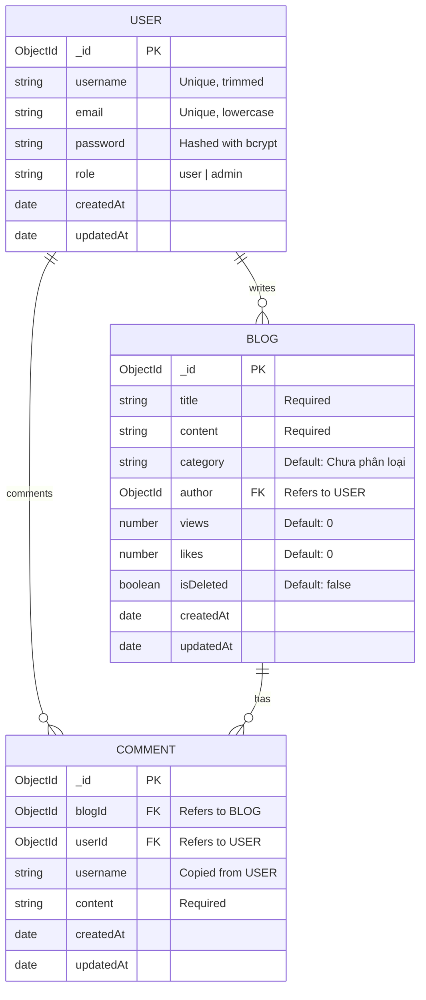

# BA Documentation - Tài liệu Phân tích Nghiệp vụ Blog Platform "Spiderum"

Tài liệu này mô tả chi tiết yêu cầu nghiệp vụ, luồng xử lý hệ thống, cấu trúc dữ liệu và các quy tắc hoạt động của ứng dụng Spiderum Blog.

---

## 1. Sơ đồ Use Case (Use Case Diagram)

Dưới đây là sơ đồ Use Case thể hiện quyền hạn tương tác của các tác nhân (Khách truy cập, Thành viên, Quản trị viên) đối với hệ thống:

```mermaid
rect white
usecase UC_ViewBlogs as "Đọc bài viết & Tìm kiếm"
usecase UC_Like as "Thích bài viết"
usecase UC_Register as "Đăng ký tài khoản"
usecase UC_Login as "Đăng nhập"
usecase UC_CreateBlog as "Viết bài mới"
usecase UC_Comment as "Bình luận bài viết"
usecase UC_EditOwn as "Chỉnh sửa bài viết của mình"
usecase UC_DeleteOwn as "Xóa bài viết của mình"
usecase UC_ManageAll as "Quản trị toàn bộ bài viết"

actor Guest as "Khách truy cập (Guest)"
actor Member as "Thành viên (Member)"
actor Admin as "Quản trị viên (Admin)"

Guest --> UC_ViewBlogs
Guest --> UC_Like
Guest --> UC_Register
Guest --> UC_Login

Member --> UC_ViewBlogs
Member --> UC_Like
Member --> UC_CreateBlog
Member --> UC_Comment
Member --> UC_EditOwn
Member --> UC_DeleteOwn

Admin --> UC_ViewBlogs
Admin --> UC_ManageAll
end
```

---

## 2. Mô hình Dữ liệu Quan hệ (ERD - Entity Relationship Diagram)

Cơ sở dữ liệu MongoDB sử dụng 3 bộ sưu tập (Collections): `users`, `blogs` và `comments` với mối quan hệ như sau:



---

## 3. Quy tắc Nghiệp vụ (Business Rules - BR)

Hệ thống bắt buộc phải tuân thủ nghiêm ngặt các quy tắc nghiệp vụ sau để đảm bảo tính an toàn dữ liệu và trải nghiệm người dùng:

| Mã quy tắc | Tên quy tắc | Mô tả chi tiết |
| :--- | :--- | :--- |
| **BR-01** | Phân quyền thao tác bài viết | - Chỉ tác giả sở hữu bài viết hoặc tài khoản có `role: "admin"` mới được sửa/xóa bài viết.<br>- Hệ thống phải từ chối yêu cầu (403 Forbidden) nếu người dùng khác cố tình chỉnh sửa. |
| **BR-02** | Ràng buộc dữ liệu Đăng ký | - `username` phải có độ dài tối thiểu 3 ký tự.<br>- `email` phải trùng khớp với biểu thức chính quy (Regex email).<br>- `password` phải có độ dài từ 6 ký tự trở lên. |
| **BR-03** | Quy tắc tăng lượt xem | - Mỗi khi người dùng (bất kể khách hay thành viên) mở trang chi tiết bài viết (`/blog/:id`), hệ thống tự động cộng dồn lượt xem (Views) lên 1 đơn vị. Lượt xem không giới hạn bởi IP. |
| **BR-04** | Ràng buộc nội dung bài viết | - Bài viết khi tạo hoặc cập nhật bắt buộc phải có `title` (tiêu đề) và `content` (nội dung) không trống hoặc không chỉ chứa khoảng trắng. |
| **BR-05** | Tính năng bình luận | - Khách vãng lai không được phép gửi bình luận. Chỉ người dùng đã đăng nhập (chứa token JWT hợp lệ) mới có thể bình luận bài viết. |

---

## 4. Tài liệu User Stories

Bảng dưới đây mô tả các yêu cầu chức năng dưới góc nhìn của người dùng:

| Mã Story | Tác nhân | Câu phát biểu Story | Tiêu chí chấp nhận (Acceptance Criteria) |
| :--- | :--- | :--- | :--- |
| **US-01** | Khách truy cập | Là một khách vãng lai, tôi muốn tìm kiếm bài viết theo từ khóa tiêu đề, để tôi nhanh chóng tiếp cận nội dung mình quan tâm. | - Hiển thị kết quả tìm kiếm ngay khi gõ từ khóa và bấm Enter.<br>- Nếu không tìm thấy, hiển thị thông báo "Không tìm thấy bài viết nào phù hợp". |
| **US-02** | Khách truy cập | Là một người dùng mới, tôi muốn đăng ký tài khoản bằng email, để tôi có thể bình luận và đăng bài viết của riêng mình. | - Form yêu cầu nhập Username, Email, Mật khẩu và Xác nhận mật khẩu.<br>- Tự động đăng nhập và chuyển về trang chủ sau khi đăng ký thành công. |
| **US-03** | Thành viên | Là một thành viên, tôi muốn viết và xuất bản bài viết mới, để chia sẻ kiến thức của mình lên cộng đồng. | - Form chọn Title, Category (Công nghệ, Lập trình, Cuộc sống, AI), và Content.<br>- Nút bấm có trạng thái loading khi đang lưu vào database. |
| **US-04** | Thành viên | Là một tác giả bài viết, tôi muốn chỉnh sửa bài viết của mình, để sửa lại các lỗi chính tả hoặc cập nhật thông tin mới. | - Nút "Sửa bài" chỉ xuất hiện đối với chủ bài viết.<br>- Load lại thông tin cũ vào form và cập nhật thành công mà không đổi ID bài viết. |
| **US-05** | Thành viên | Là một thành viên, tôi muốn bình luận dưới bài viết, để trao đổi quan điểm với tác giả và độc giả khác. | - Textarea nhập bình luận chỉ hiển thị khi đã đăng nhập.<br>- Gửi bình luận thành công hiển thị ngay lập tức danh sách bình luận mới nhất ở đầu. |
